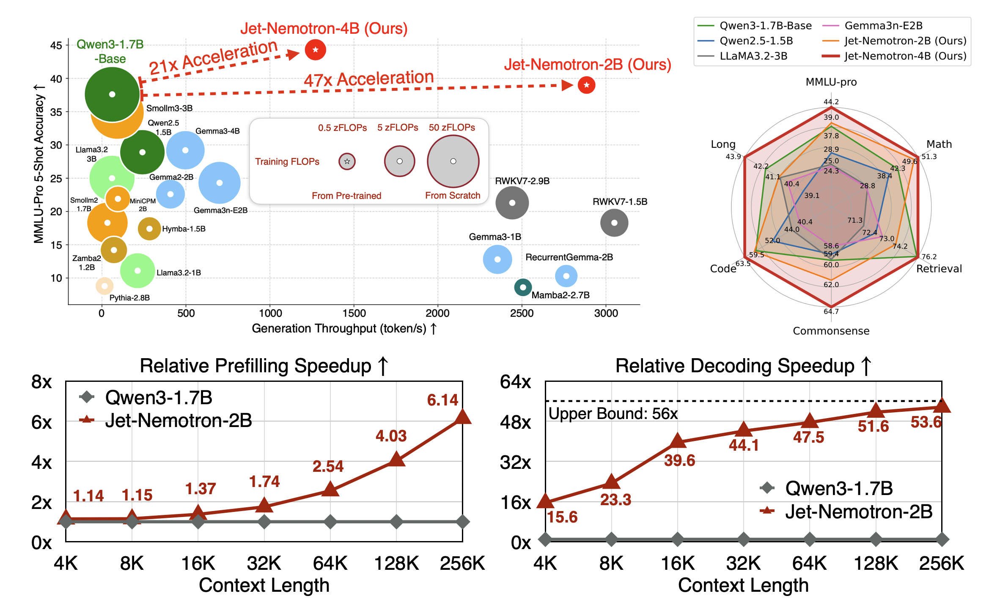
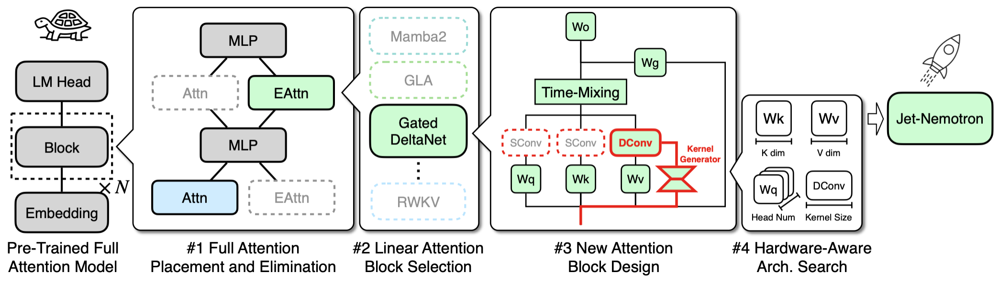
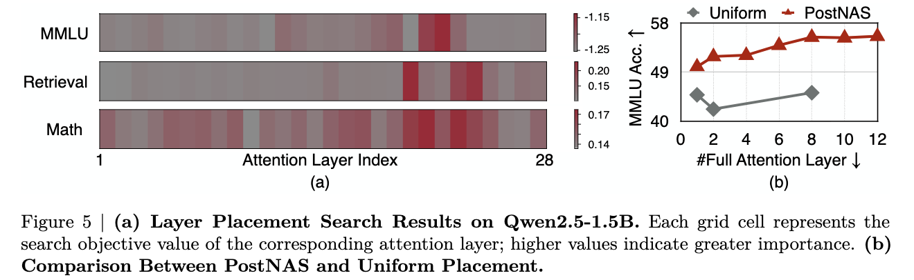
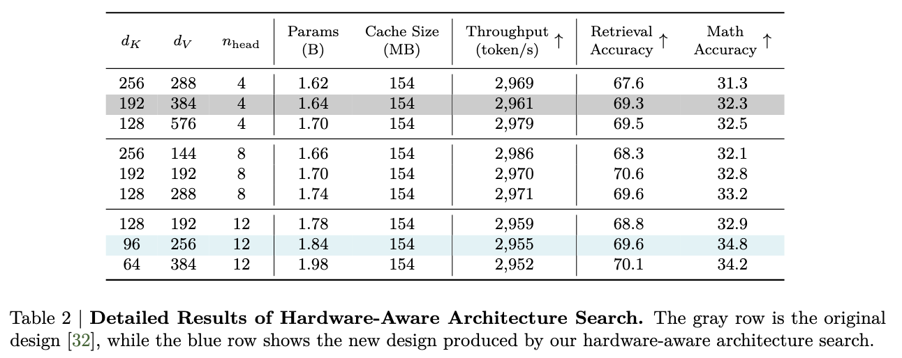
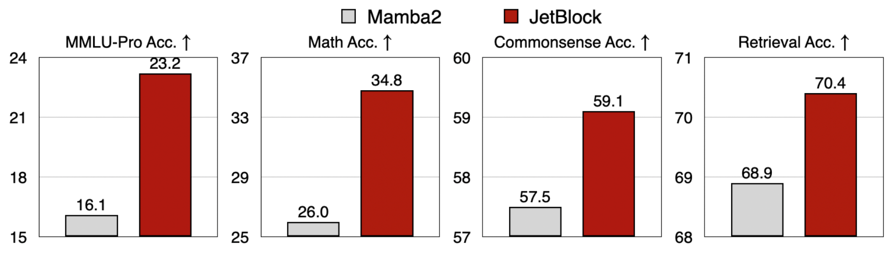
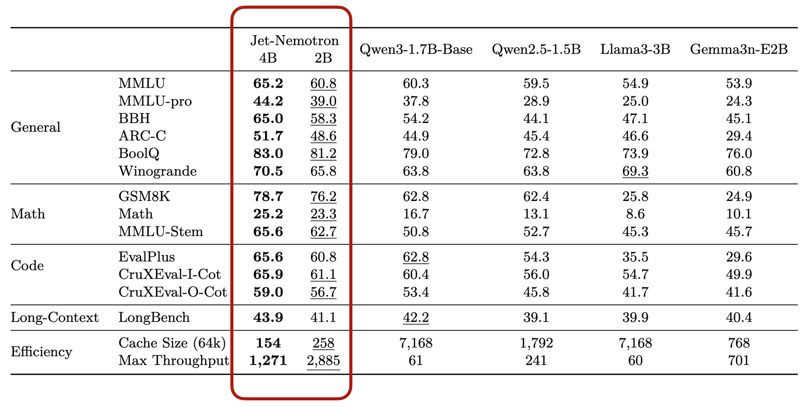

# Basic Implementation of the below paper from NVidia
Feel Free to contribute and help me implement it
Thank you


# Jet-Nemotron: Efficient Language Model with Post Neural Architecture Search

<div align="center">
  <a href="https://hanlab.mit.edu/projects/jet-nemotron/"></a> &ensp;
  <a href="https://www.arxiv.org/abs/2508.15884"></a> &ensp;
  <a href="https://youtu.be/qAQ5yMThhRY"></a> &ensp;
</div>

<p align="center" border-radius="10px">
  
</p>

## 🔥🔥 News
- (🔥 New) \[2025/8/22\] We released the Jet-Nemotron technical report on arXiv.

## 💡 Introduction

Jet-Nemotron is a new family of hybrid-architecture language models that surpass state-of-the-art open-source full-attention language models such as Qwen3, Qwen2.5, Gemma3, and Llama3.2, while achieving significant efficiency gains—up to 53.6× speedup in generation throughput on H100 GPUs (256K context length, maximum batch size). It is built upon two core innovations: 
- **Post Neural Architecture Search**, an efficient post-training architecture exploration and adaptation pipeline applicable to arbitrary pre-trained transformer models; 
- **JetBlock**, a novel linear attention block that significantly outperforms previous designs such as Mamba2.

### Highlight 1: PostNAS – Post-Training Architecture Exploration and Adaptation
Unlike prior methods that train from scratch to explore new model architectures, PostNAS builds on a pre-trained transformer model while enabling flexible exploration of attention block designs, greatly reducing the cost and risk of developing new language model architectures. 

- <ins>PostNAS first identifies the optimal placement of full-attention layers, then searches for improved attention block designs.</ins>
<figure>
  
</figure>

- <ins>In the pre-trained transformer model, not all attention layers contribute equally. PostNAS reveals important attention layers within pre-trained transformer models. </ins>
<figure>
  
</figure>

- <ins>KV cache size is the most critical factor influencing long-context and long-generation throughput. PostNAS hardware-aware search discovers architectures that deliver similar generation throughput, while having more parameters and achieving better accuracy. </ins>
<figure>
  
</figure>

### Highlight 2: JetBlock - A New Linear Attention Module with SOTA Accuracy
With PostNAS, we introduce the JetBlock — a novel linear attention module that integrates dynamic convolution with hardware-aware architecture search to enhance linear attention, delivering substantial accuracy gains over previous designs while maintaining similar training and inference throughput. Below, we present an apples-to-apples comparison between the Mamba2 Block and the JetBlock, using identical training data and training recipes.

<p align="center" border-radius="10px">
  
</p>

### Performance
Jet-Nemotron-2B and Jet-Nemotron-4B match or surpass the accuracy of leading efficient language models (e.g., Qwen3) across a comprehensive benchmark suite while running significantly faster — 21× and 47× faster than Qwen3-1.7B-Base, respectively.
<figure>
  
</figure>

## Contents
The code and pretrained models will be released after the legal review is completed.

## Contact
[Han Cai](http://hancai.ai/)

[Yuxian Gu](https://t1101675.github.io/)

# 📖BibTeX
```
@article{
 jet-nemotron,
 title={Jet-Nemotron: Efficient Language Model with Post Neural Architecture Search},
 author={Gu, Yuxian and Hu, Qinghao and Yang, Shang and Xi, Haocheng and Chen, junyu and Han, Song and Cai, Han},
 journal={arXiv preprint arXiv:2508.15884},
 year={2025}
}
```
